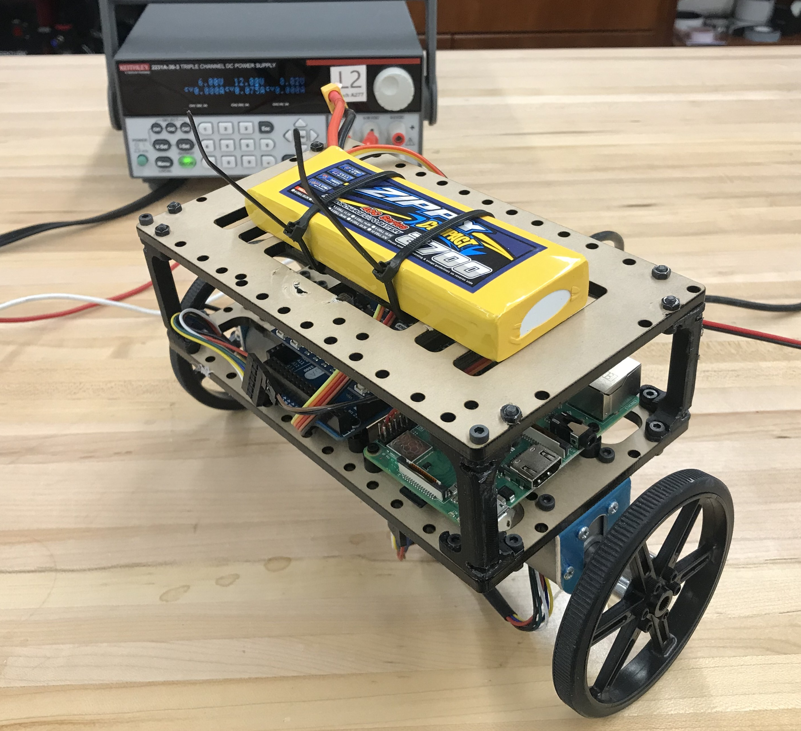
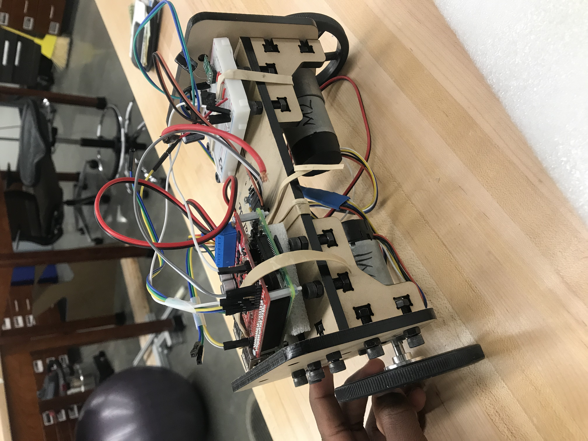
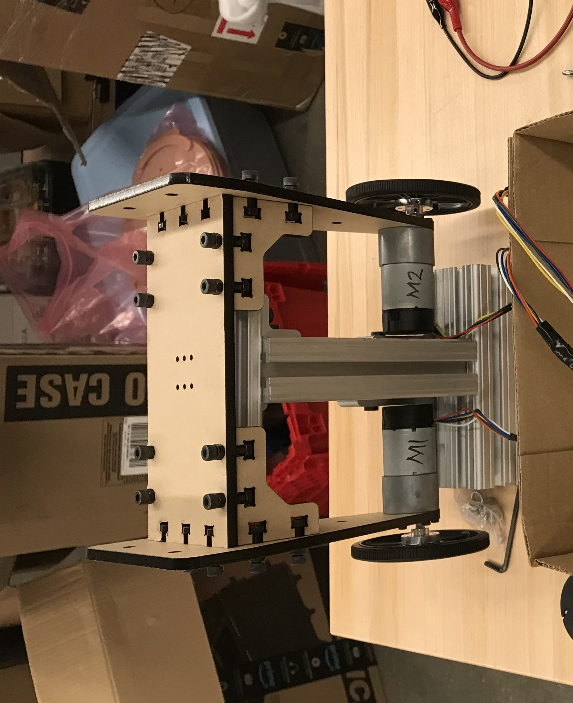
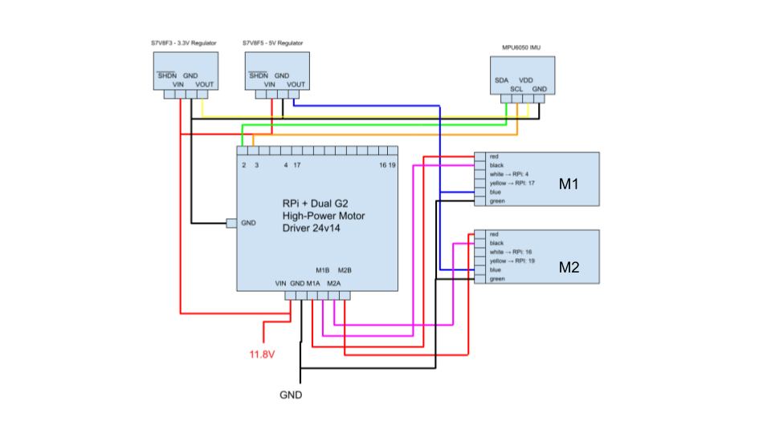
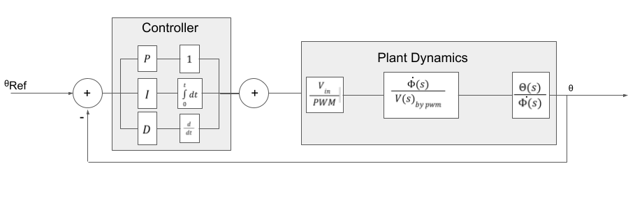

# LanceBot 

The beginnings of a two-wheeled bipedal platform robot for experimenting with and implementing self balancing controllers.
[See portfolio post] (https://kjwelbeck3.vercel.app/projects/lancebot_1)

## Mechanical Design

The project thus far has gone through a series of mechanical changes including a complete redesign along the way, towards a lighter unit.

### Current Build

### Previous Builds

## Electrical Schematic

This electrical wiring diagram shows (i) the  microprocessor fitted with (ii) a dual motor driver and interfacing with (iii) the Intertial Measurement Unit (IMU) by i2c communication and (iv) two motors, each with a connection to PWM and DIRECTION gpio pins on the driver.
There are additionally, (v) two voltage regulators to power (vi) the motor encoders (5V) and the IMU (3.3V).

#### Current Build Components
 - Arduino Mega 2560 (microcontroller)
 - Raspberry Pi for High level control (yet to be implemented)
 - IMU - LSM6DS33 3D Accelerometer and Gyro Carrier with Voltage Regulator
 - Motors - Pololu 19:1 Metal Gearmotor 37Dx68L mm 12V with 64 CPR Encoder
 - Dual Motor Driver - Cytron Sheild-MDD10
 - Lab Bench DC power supply

#### Previous Build Components 
 - Raspberry Pi (microprocessor)
 - Dual Motor Driver - PololuDual G2 High-Power Motor Driver 24v14 for Raspberry Pi
 - 3.3V voltage regulator - Pololu S7V8F3
 - 5V voltage regulator - Pololu S7V8F5

## PID Control Scheme

The schematic shows how the robot’s measured pitch angle(Θ) is fed back to a controller where a PWM command is composed to determine the the voltage sent to command the rate of wheel angle (𝛷). 
